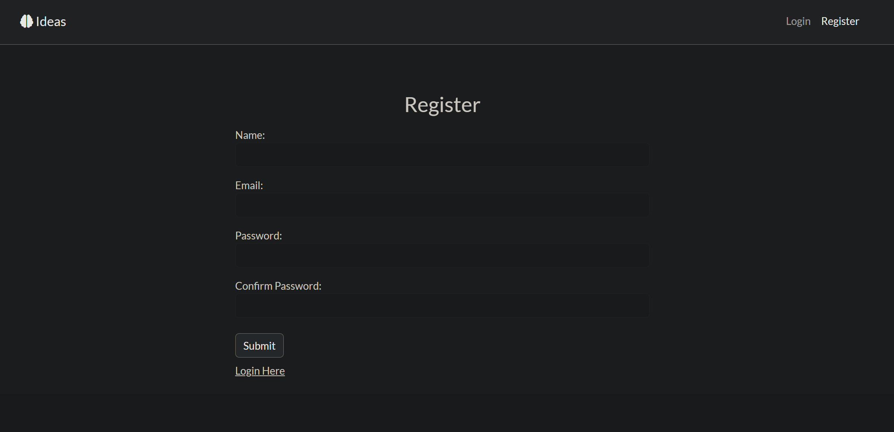
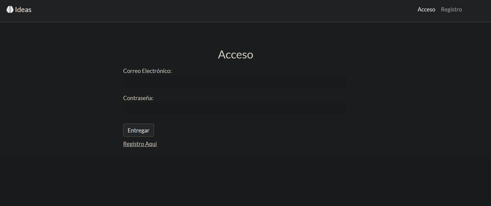
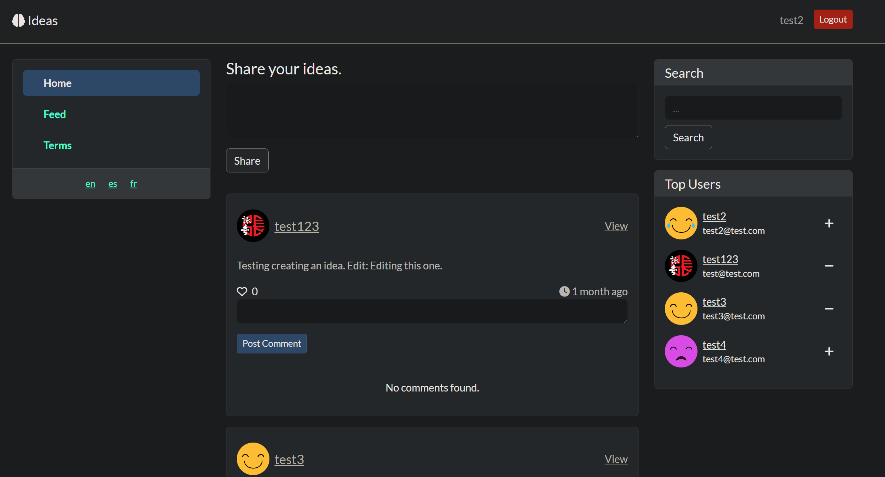
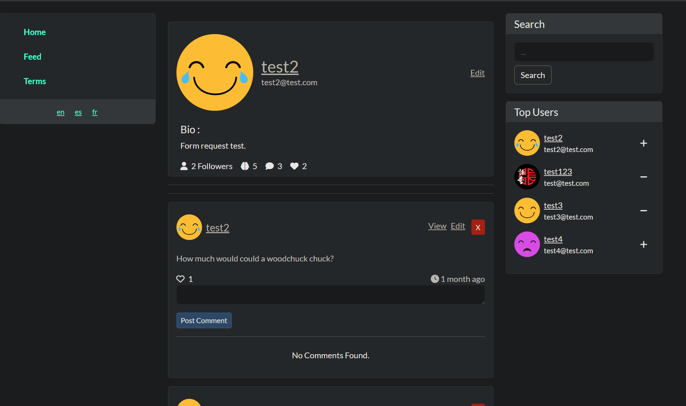
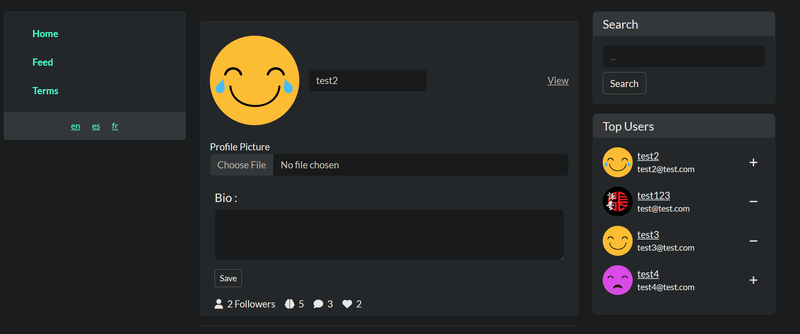
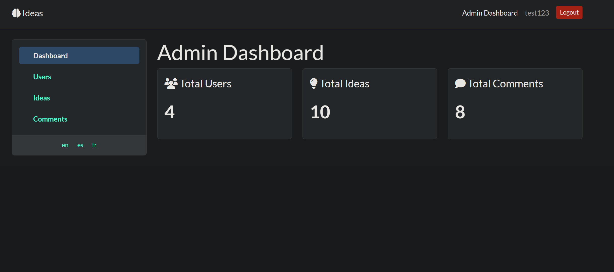
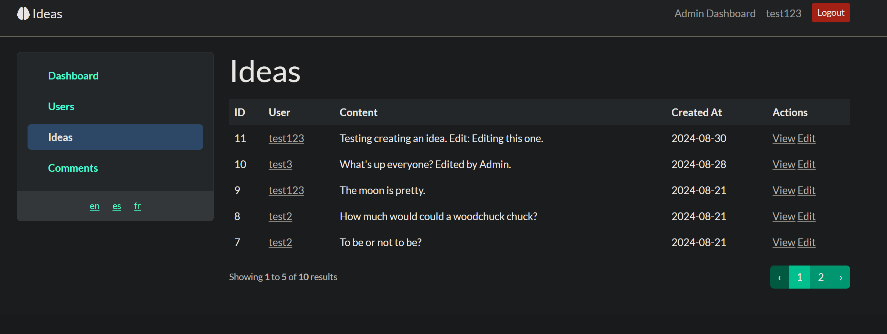
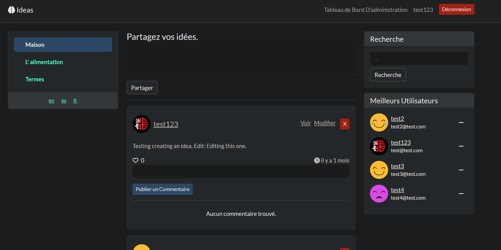

# Twitter Clone

## Table of Contents
* [General Info](#general-info)
* [Technologies](#technologies)
* [Setup](#setup)
* [Screenshots](#screenshots)

## General Info
A project that utilizes Laravel to put together several software principles that I have learned so far. This project is a social media application which allows users to share their ideas, follow each other, and comment on each others' ideas. I chose to work on such a project because I believe that social media applications possess many characteristics desired and which are practical for modern applications such as: security policies, administrative tools, and a clean user interface. 

## Technologies
Project created with:
* Laravel 11.8.0
* PHP 8.3
* SQL(MySQL)
* CSS(Boostrap 5.3.0)
* Blade Templates
* MailTrap
* Docker 4.17.0

## Setup
Simply use the docker composer file.

Example:

Navigating to the directory containing the docker-compose.yml file in your terminal, execute:

```
docker-compose up
```

## Screenshots
Registration Page:



Translated Login Page:



Home Page:



User View:



User Edit:



Administration Dashboard View:



Administration Panel View:



Translated Home Page:

